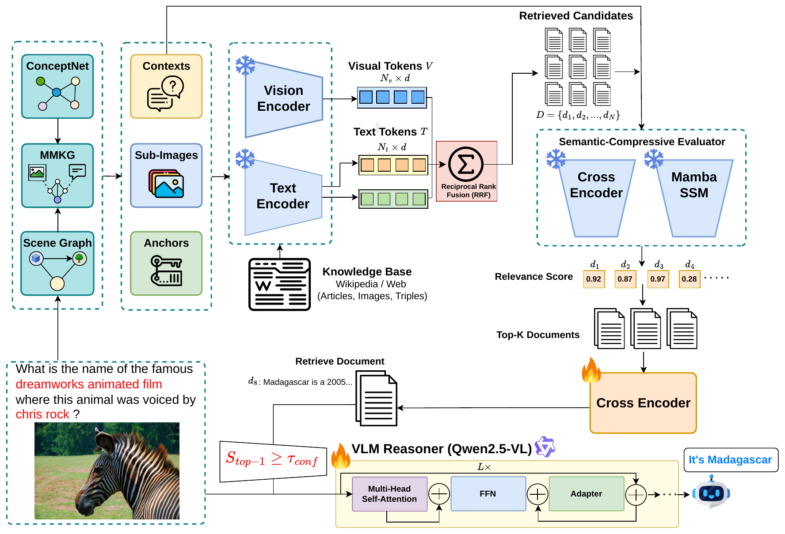

# SCEDG: Semantic-Compressive Evidence Selection and Dynamic Gating for Knowledge-Based VQA

<!-- TODO before publishing: replace YOUR-GITHUB-USER, add the paper link and DOI once available. -->

[](#citation)
[](LICENSE)
[](https://colab.research.google.com/github/YOUR-GITHUB-USER/SCEDG/blob/main/notebooks/Preparation.ipynb)
[](https://colab.research.google.com/github/YOUR-GITHUB-USER/SCEDG/blob/main/notebooks/Pipeline.ipynb)

Official code for the paper **"SCEDG: Semantic-compressive evidence selection and dynamic gating for knowledge-based visual question answering"** by Thien Dao, Phat Bui, Thai Nguyen, Kha Dang, and Thanh Le (Faculty of Information Technology, University of Science, VNU-HCM).

<p align="center">
  
</p>

## Overview

Knowledge-based visual question answering (KB-VQA) asks questions that the image alone cannot answer, so vision-language models (VLMs) are often given passages retrieved from an external corpus. Retrieved text is noisy, and for compact models it can do more harm than good. On OK-VQA, adding the top retrieved passage to every prompt lowers the accuracy of a fine-tuned Qwen2.5-VL-3B model from 63.11% to 53.02%.

SCEDG treats three decisions separately: which candidates to retrieve, which passage to select, and whether to use that passage at all.

1. **Multi-view retrieval.** Visual queries (the image and question-related crops), contextual queries (the question and a caption built from a REACT scene graph), and entity-anchor queries (question entities and ConceptNet concepts) search a LongCLIP-L index over about six million Wikipedia entities (Wiki6M). The ranked lists are fused with reciprocal rank fusion (RRF).
2. **Semantic-compressive evaluator (SCE).** A cross-encoder (`mxbai-rerank-large-v1`) scores the pool, and a frozen Mamba-2 model adds a training-free score that follows the normalization of normalized compression distance but uses representation energy instead of compressed length.
3. **Task-specific reranker.** A reranker fine-tuned with answer-matching labels and teacher soft targets selects one passage and returns its confidence `S_max`.
4. **Confidence gate.** Outside the VLM, a threshold on `S_max` decides for each question whether the passage enters the prompt or the VLM answers from the image and question alone. The gate needs no special tokens and works with different backbones.

## Results

VQA accuracy (%) with Qwen2.5-VL-3B as the answer generator. Base is the same model fine-tuned without retrieved knowledge.

| Setting | Base | SCEDG | Gain |
|---|---:|---:|---:|
| OK-VQA test | 63.11 | **63.81** | +0.70 |
| OK-VQA test, mean of five training seeds | 63.04 | **63.72** | +0.68 (95% CI [+0.31, +1.06]) |
| A-OKVQA validation, direct answer | 64.02 | **66.59** | +2.57 |
| A-OKVQA test, direct answer (official server) | 62.5 | **64.5** | +2.0 |

How the retrieved evidence is handled matters more than how much is retrieved (OK-VQA test, same generator and knowledge base):

| Configuration | Passages in the prompt | VQA accuracy |
|---|:---:|---:|
| Base, no retrieval | 0 | 63.11 |
| Top retrieved passage, no filtering | 1 | 53.02 |
| Cross-encoder top-1, no gate | 1 | 60.16 |
| Cross-encoder top-5, concatenated | 5 | 61.24 |
| **SCEDG** | 0 or 1 | **63.81** |

The paper also reports gains with PaliGemma2-3B (61.34 to 61.93) and SmolVLM (59.02 to 59.52) under the same retrieval, filtering, and gating configuration. This repository contains the Qwen2.5-VL-3B pipeline.

## Repository structure

```
SCEDG/
├── notebooks/
│   ├── Preparation.ipynb   # builds the LongCLIP-L FAISS index over Wiki6M (run once)
│   └── Pipeline.ipynb      # retrieval, SCE, reranker, Qwen2.5-VL LoRA, gated evaluation
├── configs/
│   └── react_yoloworldv2_vg150.yaml  # REACT scene-graph configuration used by the notebook
├── docs/
│   ├── DATA.md             # data sources, licenses, expected directory layout
│   ├── PIPELINE.md         # stage-by-stage description, intermediate files, hyperparameters
│   └── assets/overview.png
├── requirements.txt
├── CITATION.cff
└── LICENSE
```

## Requirements

- A GPU runtime on Google Colab, or a Linux machine with an NVIDIA GPU, CUDA 12.x, and Python 3.12. The experiments in the paper were run on a single NVIDIA RTX 6000 GPU.
- About 20 GB of storage for the Wiki6M index (six million 768-dimensional float32 vectors plus metadata), and room for the intermediate caches.
- A Hugging Face account and an access token with write permission. The fine-tuned adapters and the experiment logs are pushed to the Hub.
- Internet access to the Hugging Face Hub, GitHub, and the ConceptNet API (`api.conceptnet.io`).

The notebooks install their own dependencies in the first cells. For a local environment, `requirements.txt` lists the same pinned versions:

```bash
pip install -r requirements.txt
python -m spacy download en_core_web_trf
```

Long-CLIP and SGG-Benchmark (REACT) are cloned by the notebooks. SGG-Benchmark runs in its own virtual environment, created with its `scripts/install_uv.sh`.

## Data

| Resource | Role in SCEDG | How it is obtained |
|---|---|---|
| OK-VQA ([`Multimodal-Fatima/OK-VQA_train`](https://huggingface.co/datasets/Multimodal-Fatima/OK-VQA_train), [`OK-VQA_test`](https://huggingface.co/datasets/Multimodal-Fatima/OK-VQA_test)) | main benchmark | downloaded automatically from the Hugging Face Hub |
| A-OKVQA ([`HuggingFaceM4/A-OKVQA`](https://huggingface.co/datasets/HuggingFaceM4/A-OKVQA)) | second benchmark | downloaded automatically |
| Wiki6M (`Wiki6M_ver_1_0.jsonl.gz`, released with [OVEN](https://github.com/open-vision-language/oven)) | knowledge base, the only source of retrieved passages | downloaded by `Preparation.ipynb`, or placed manually in `<ROOT_DIR>/KB/` |
| [ConceptNet 5](https://conceptnet.io) API | entity-anchor queries only, never returned as evidence | queried online and cached |
| VG150 (through [SGG-Benchmark](https://github.com/Maelic/SGG-Benchmark)) | statistics and labels for the REACT scene-graph model | downloaded automatically by `Pipeline.ipynb` |
| REACT + YOLO-WorldV2 relation checkpoint | scene graphs for contextual and visual queries | trained with SGG-Benchmark on VG150 using [`configs/react_yoloworldv2_vg150.yaml`](configs/react_yoloworldv2_vg150.yaml) |

[docs/DATA.md](docs/DATA.md) gives the download links, licenses, and file formats. By default the notebooks expect this layout on Google Drive:

```
<ROOT_DIR>/                                  # default: /content/drive/MyDrive/dataset
├── KB/
│   ├── Wiki6M_ver_1_0.jsonl.gz
│   └── Chunk_files/Long-CLIP-L_Wiki6M/      # written by Preparation.ipynb
│       ├── wikidata_text_longclip_part<k>.index
│       ├── metadata_text_longclip_part<k>.json
│       └── index_progress.json
└── models/
    ├── react_yoloworldv2_vg150/             # REACT relation checkpoint (best_model*.pth and its .yaml config)
    └── <okvqa|aokvqa>/cross_encoder/mixedbread/
        └── cross_encoder_final_weights.pth  # task-specific reranker, written by Pipeline.ipynb
```

## Quick start

1. Open both notebooks in Colab and select a GPU runtime.
2. Add `HF_TOKEN` (write access) to **Colab Secrets** and allow notebook access. In **3. Configuration** of `Pipeline.ipynb`, set `HF_USERNAME` to your Hugging Face account and `ROOT_DIR` to your data directory.
3. Run `Preparation.ipynb` once. It downloads Wiki6M if needed and builds the FAISS index. Interrupted runs resume from the last finished chunk.
4. Run `Pipeline.ipynb` three times, changing `DATASET_SPLIT` between runs and executing every cell from the top each time:

   | Run | `DATASET_SPLIT` | Result |
   |---|---|---|
   | 1 | `train` | evidence caches, trained reranker, LoRA adapter pushed to `<HF_USERNAME>/<dataset>_qwen_k_6m_mambancd_rerank_run1` |
   | 2 | `validation` | accuracy of every saved checkpoint for gate thresholds 0.55, 0.7, 0.8, 0.9, 1.0 (used for model selection) |
   | 3 | `test` | final accuracy with gate threshold 0.9 |

5. Read the metrics in `/content/experiment_logs/<RUN_NAME>/eval_results_tracker.jsonl`. Per-question predictions are in `predictions_<strategy>.json` in the same folder, and both are also uploaded to the private tracking repository on the Hub.

For A-OKVQA, set `DATASET_NAME = "A-OKVQA"` and repeat step 4. The A-OKVQA test answers are hidden, so the accuracy printed for `test` is not meaningful. Convert `predictions_<strategy>.json` into the leaderboard format, `{"<question_id>": {"direct_answer": "<prediction>", ...}}`, and submit it to the [A-OKVQA leaderboard](https://leaderboard.allenai.org/a-okvqa/submissions/public).

Retrieval, cross-encoder reranking, and SCE append to JSONL files and skip questions that are already processed, so an interrupted run can be resumed by running the notebook again.

## How the notebook maps to the paper

| Notebook section | Paper | Output in `CACHE_DIR` |
|---|---|---|
| 4. Dataset loading and multi-view query formation | Sec. 3.2 | REACT scene graphs, `conceptnet_minilm_cache.json` |
| 5. Multi-view retrieval and RRF | Sec. 3.2, Eq. 4 | `raw_retrieval.jsonl` (top 350) |
| 6. Cross-encoder reranking | Sec. 3.3 | `cross_encoder_top50.jsonl` |
| 6.1. Semantic-compressive evaluator | Sec. 3.3, Eq. 5 to 9 | `mamba_top10.jsonl` (top 10) |
| 7. Summary dataset | | `summary_dataset.json` |
| 8. Task-specific reranker | Sec. 3.4, Eq. 10 and 11 | `cross_encoder_labels.json`, `dataset_one_knowledge.json` |
| 9. Qwen2.5-VL LoRA fine-tuning | Sec. 3.6, Algorithm 1 | adapter on the Hugging Face Hub |
| 10. Gated inference and evaluation | Sec. 3.5, Eq. 12 | `eval_results_tracker.jsonl`, `predictions_*.json` |

[docs/PIPELINE.md](docs/PIPELINE.md) describes each stage, the file formats, and all hyperparameters.

## Main hyperparameters

| Component | Setting |
|---|---|
| Retrieval | LongCLIP-L, 120 candidates per query, RRF with `k_rrf = 60`, pool of 350 |
| Cross-encoder | `mixedbread-ai/mxbai-rerank-large-v1`, top 50 kept, top 25 passed to SCE |
| SCE | `state-spaces/mamba2-130m`, equal weights for cross-encoder and Mamba-2 scores, top 10 kept |
| Reranker | initialized from `mxbai-rerank-large-v1`, teacher scale 3, 8 epochs, learning rate 1e-4, batch 8 with gradient accumulation 8 |
| Answer generator | `Qwen/Qwen2.5-VL-3B-Instruct`, LoRA rank 32, alpha 64, dropout 0.2, learning rate 5e-6, 6 epochs, batch 8 with gradient accumulation 4, cosine schedule, 10% warmup, weight decay 0.05 |
| Gate | training threshold 0.7, inference threshold 0.9 |
| Protocol | seed 42, OK-VQA training split divided 85/15 by image for model selection |

## Notes on reproducibility

- `SEED` fixes Python, NumPy, and PyTorch seeds and enables deterministic algorithms where possible. It also controls the 85/15 image split of the OK-VQA training set, so changing it changes the development split.
- The REACT relation checkpoint must come from `REACTPredictor` with the YOLO-WorldV2 backbone. When a configuration file is stored next to the checkpoint, the notebook refuses it unless the file mentions both.
- The ConceptNet API is queried online. Responses are cached in `conceptnet_minilm_cache.json`. With `CONCEPTNET_STRICT = True` (default), a failed request stops the run instead of silently changing the anchor queries.
- `CACHE_DIR` lives on the Colab virtual machine (`/content/kg_vqa_cache`). Point it to Google Drive if you want the intermediate files to survive a disconnected session.
- Single-run results can differ slightly from the paper because of GPU nondeterminism. The paper reports a five-seed analysis for the main OK-VQA comparison.

## Released checkpoints

<!-- TODO before publishing: fill in the released artifacts (or remove this section). -->

| Artifact | Link |
|---|---|
| Qwen2.5-VL-3B LoRA adapter, OK-VQA | TODO |
| Qwen2.5-VL-3B LoRA adapter, A-OKVQA | TODO |
| Task-specific reranker weights | TODO |
| REACT + YOLO-WorldV2 relation checkpoint (VG150) | TODO |

To evaluate a released adapter, set `HF_USERNAME` and `RUN_NAME` so that `MODEL_REPO_ID` points to it, place the reranker weights in `MODEL_DIR`, and run `Pipeline.ipynb` with `DATASET_SPLIT = "test"`.

## Citation

If you use this code, please cite:

```bibtex
@article{dao2026scedg,
  title   = {{SCEDG}: Semantic-compressive evidence selection and dynamic gating for knowledge-based visual question answering},
  author  = {Dao, Thien and Bui, Phat and Nguyen, Thai and Dang, Kha and Le, Thanh},
  journal = {Knowledge-Based Systems},
  year    = {2026},
  note    = {Submitted}
}
```

<!-- TODO: update volume, pages, and DOI after publication. -->

## Acknowledgements

This research is funded by the Vietnam National Foundation for Science and Technology Development (NAFOSTED) under grant number 102.05-2025.75.

SCEDG builds on [Long-CLIP](https://github.com/beichenzbc/Long-CLIP), [SGG-Benchmark and REACT](https://github.com/Maelic/SGG-Benchmark), [OVEN and Wiki6M](https://github.com/open-vision-language/oven), [Qwen2.5-VL](https://huggingface.co/Qwen/Qwen2.5-VL-3B-Instruct), [mxbai-rerank](https://huggingface.co/mixedbread-ai/mxbai-rerank-large-v1), [Mamba](https://github.com/state-spaces/mamba), [GLiNER](https://github.com/urchade/GLiNER), [spaCy](https://spacy.io), [Sentence-Transformers](https://www.sbert.net), [ConceptNet](https://conceptnet.io), and [FAISS](https://github.com/facebookresearch/faiss). We thank their authors for releasing them.

## License

The code in this repository is released under the [MIT License](LICENSE). Datasets, knowledge bases, and pretrained models used by the notebooks are distributed under their own licenses. Please check the sources listed in [docs/DATA.md](docs/DATA.md) before redistributing them.

## Contact

Thanh Le (corresponding author), Faculty of Information Technology, University of Science, VNU-HCM, Vietnam. Email: lnthanh@fit.hcmus.edu.vn
